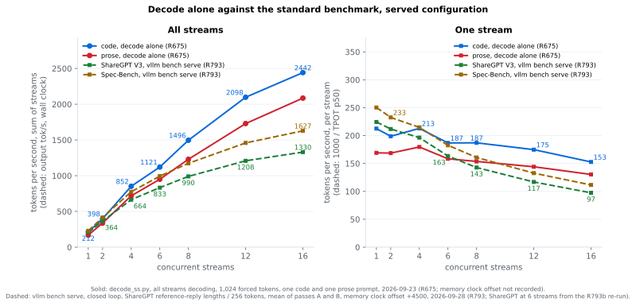
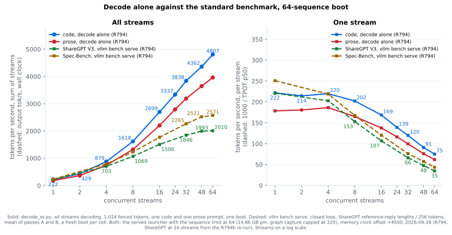

# Qwen3.8-27B on RTX 5090

Serving configuration, vLLM patches, launch scripts and measurements for [Qwen3.8-27B](https://huggingface.co/Qwen/Qwen3.8-27B), served as [nvidia/Qwen3.8-27B-NVFP4](https://huggingface.co/nvidia/Qwen3.8-27B-NVFP4) by [vLLM](https://github.com/vllm-project/vllm) v0.29.0rc2 with the patch chain in [patches-v0290/](patches-v0290/) across two RTX 5090 cards. The window is 262,144 tokens, the KV cache is NVFP4, the checkpoint's own MTP head drafts 3 tokens, and vision, reasoning, tool calls and structured output are all on. The target workload is a few concurrent coding agents with long contexts. The one-card and older shapes are under [Other configurations](#other-configurations).

Every number here was measured on one machine on the date given, and each links the write-up that names its raw results directory. None is an estimate. The index of experiments is [bench/RESULTS.md](bench/RESULTS.md), newest first.

## Numbers

Decode on the served launcher [scripts/serve-r231-nvidia-daily.sh](scripts/serve-r231-nvidia-daily.sh), image `vllm-qwen38:v0290rc2-nvfp4kv-revival-prs-fi0616-pcieipc-bsshash-mtppcie-mtpcache-eagleshift`, one boot at stock power limits, measured 2026-09-23 11:33 to 11:51 UTC ([R675](bench/results/r675-27b-curves.md), results `2026-09-23-r675-27b-curves`; the memory clock offset was not recorded): [scripts/decode_ss.py](scripts/decode_ss.py), greedy, one code and one prose prompt, 1,024 forced tokens per stream, all streams starting together, three runs per shape. Rates are tokens per second per stream over the samples where every stream was decoding; the aggregate is the sum over the streams running together. Method: [How the numbers are measured](#how-the-numbers-are-measured).



Solid lines: decode alone, the curve described above. Dashed lines: vLLM's serving benchmark `vllm bench serve` v0.30.0 on ShareGPT V3 and Spec-Bench against the same launcher ([R793](bench/results/r793-27b-std-bench.md), 2026-09-28, results `2026-09-28-r793-27b-std-bench-1608` and `2026-09-28-r793b-27b-c6-1905`), a fresh boot per cell and the mean of two passes. Requests arrive as others finish, so their prefill interleaves with the running streams' decode; the aggregate is wall-clock output tok/s and its per-stream rate is 1000 / TPOT p50 ([Standard benchmark](#standard-benchmark-vllm-bench-serve)).

- The aggregate rises at every step to the served limit of 16 sequences: 2,443 t/s of code and 2,086 of prose at 16 streams, 153 and 130 per stream. One stream decodes 212.5 t/s of code and 169.1 of prose ([R675](bench/results/r675-27b-curves.md)).
- The rates depend on how many draft tokens the MTP head gets accepted, which depends on the text: 0.61 to 0.68 of the draft tokens on code and 0.46 to 0.49 on prose at every concurrency ([R675](bench/results/r675-27b-curves.md)), 2.92 to 2.96 tokens per verify step on ShareGPT and 3.22 to 3.24 on Spec-Bench ([R793](bench/results/r793-27b-std-bench.md)).
- On the standard benchmark at 16 streams the server delivers 1,330 (ShareGPT) and 1,628 (Spec-Bench) output tok/s, 97 and 111 per stream; time to the first token p50 is 42 to 44 ms at 1 stream and 176 ms at 16 ([R793](bench/results/r793-27b-std-bench.md)).


Cold prefill on the same boot runs at 8,365 t/s at 6.7K prompt tokens and 3,958 at 200K, because every full-attention layer reads the whole prefix for each chunk ([R675](bench/results/r675-27b-curves.md), [scripts/kv_capacity_probe.py](scripts/kv_capacity_probe.py), prompt tokens counted by the server). One stream decoding on top of filler context holds its code rate to 60K and reads 13 % lower at 200K.

| | value | source |
|---|---|---|
| context window | 262,144 tokens | checkpoint |
| KV pool on the GPUs | 1,391,795 tokens, NVFP4, pinned at 14.86 GB per card, 16 sequences | 2026-09-09, [R234](bench/results/r231-promote-nvidia.md) |
| free VRAM after boot | 3,351 MiB per card | 2026-09-23, [R675](bench/results/r675-27b-curves.md) |
| KV tiers behind the pool | 16 GiB host RAM, then 300 GB of disk with LRU eviction, kept across restarts | 2026-09-05, [R189](bench/results/r189-promote-pcie-ipc.md) |
| TTFT, cold prompt | 0.8 / 3.0 / 17.5 / 50.6 s at 6.7K / 25K / 100K / 200K prompt tokens | 2026-09-23, [R675](bench/results/r675-27b-curves.md) |
| [SWE-Bench Verified](https://huggingface.co/datasets/princeton-nlp/SWE-bench_Verified), [mini-SWE-agent](https://github.com/SWE-agent/mini-swe-agent) 2.4.6, one attempt | 387/500 = 77.4 % | 2026-09-09, [R231](bench/results/r231-promote-nvidia.md), results `2026-09-09-r227-miniswe-nvidia` |
| [tool-eval](https://github.com/SeraphimSerapis/tool-eval-bench), 69 × 4 | 88.5 ± 0.6 and 90.5 ± 3.7, two runs | 2026-09-09, [R231/R234](bench/results/r231-promote-nvidia.md) |
| fidelity vs the [bf16 model](https://huggingface.co/Qwen/Qwen3.8-27B), dense text, 555,549 positions | top-1 90.67 %, perplexity +1.83 %, truncated KL 0.0226 | 2026-09-09, [R231](bench/results/r231-promote-nvidia.md) |
| fidelity vs the bf16 model, greedy decode | median absolute log-prob delta 0.00046 at no context, 0.00516 at 30K | 2026-09-09, [R231](bench/results/r231-promote-nvidia.md) |

Also passing (2026-09-09, [R231/R234](bench/results/r231-promote-nvidia.md)): needles at 131K and 220K prompt tokens, 4 of 4 cold and 4 of 4 from the disk tier after a flood of 19 unrelated 90K prompts; five concurrent 120K prompts resident at 58.8 % of the pool with no preemptions; one 250K prompt; an indentation probe with 59 of 60 answers indented.

## Served configuration

- Since 2026-09-09 ([R231/R234](bench/results/r231-promote-nvidia.md)): weights [nvidia/Qwen3.8-27B-NVFP4](https://huggingface.co/nvidia/Qwen3.8-27B-NVFP4), image `vllm-qwen38:v0290rc2-nvfp4kv-revival-prs-fi0616-pcieipc-bsshash-mtppcie-mtpcache-eagleshift` (vLLM v0.29.0rc2, [patches-v0290/](patches-v0290/) 0101 to 0158, FlashInfer 0.6.16.post3), port 8020. Launcher [scripts/serve-r231-nvidia-daily.sh](scripts/serve-r231-nvidia-daily.sh); [scripts/serve.sh](scripts/serve.sh) starts the same engine with the host paths as settings. Rollback: [scripts/serve-r207-mtp-daily.sh](scripts/serve-r207-mtp-daily.sh), the same route on [RedHatAI/Qwen3.8-27B-NVFP4](https://huggingface.co/RedHatAI/Qwen3.8-27B-NVFP4) at a 13.98 GB pin ([R207](bench/results/r207-promote-mtp.md)). Each promotion is a row in [docs/HISTORY.md](docs/HISTORY.md), and every flag is explained in [docs/CONFIG.md](docs/CONFIG.md).
- Tensor parallel 2, 16 sequences, 262,144-token window, NVFP4 KV pinned at 14.86 GB per card (`--kv-cache-memory-bytes`), linear-attention state cached in bf16.
- The checkpoint's MTP head at 3 draft tokens (`qwen3_5_mtp`).
- FlashInfer's `pcie_ipc` all-reduce as the two-card decode all-reduce (patch 0138, `VLLM_SM12X_PCIE_IPC_AR=1`; patch 0148 admits the MTP head to it) and batch-sharded sampling (`--enable-batch-sharded-sampling`, patch 0147).
- KV tiers: 16 GiB of pinned host RAM, then a 300 GB disk tier with LRU eviction and a 40 GB free-space floor.

## What the stack is

- **Weights**: [nvidia/Qwen3.8-27B-NVFP4](https://huggingface.co/nvidia/Qwen3.8-27B-NVFP4), a ModelOpt 0.47.0.dev80 checkpoint: NVFP4 group-16 on all 64 MLP layers, an NVFP4 `lm_head`, and an input scale on all 401 quantized layers, so activations are quantized too (W4A4). It declares no KV quantization; the KV dtype is the launcher's. Its distance from bf16 is in the table above and in [docs/FIDELITY.md](docs/FIDELITY.md).
- **Engine**: [vLLM v0.29.0rc2](https://github.com/vllm-project/vllm/releases) with the [patches-v0290/](patches-v0290/) chain (0101 to 0158).
  - NVFP4 KV on `sm_120`, which upstream gates to SM100.
  - A pooled FlashInfer workspace, prefix-cache reuse under speculative decoding, the embedding table in pinned host RAM.
  - LRU eviction for the disk tier, which upstream lacks.
  - FlashInfer main's `pcie_ipc` all-reduce as the two-card decode all-reduce, vendored as patch 0138 behind `VLLM_SM12X_PCIE_IPC_AR=1` and asserted at boot; served since 2026-09-05 ([R185](bench/results/r185-pcie-ipc-all-reduce.md)). Patch 0148 admits the MTP head to it.
  - Patches 0152, 0154 to 0156 and 0158 make the prefix cache and the offload tiers hit under the MTP head, including the linear-attention state blocks ([THIRD_PARTY.md](THIRD_PARTY.md)).
  - [FlashInfer](https://github.com/flashinfer-ai/flashinfer) pinned at 0.6.16.post3 ([R168](bench/results/r168-029-program.md)).
  - vLLM's `--enable-batch-sharded-sampling`, with patch 0147 so the flag does not fork the compile artifact ([R193e](bench/results/r193e-pin-and-bss.md)).
  - [scripts/build-served-image.sh](scripts/build-served-image.sh) builds the served image from [patches-v0290/](patches-v0290/) in nine layers; each patch has a design note next to its diff and a provenance line in [THIRD_PARTY.md](THIRD_PARTY.md).
- **Speculative decoding**: the checkpoint's own MTP head, 3 draft tokens, since 2026-09-06 ([R207](bench/results/r207-promote-mtp.md)). The DFlash2 drafter served before it is in [docs/HISTORY.md](docs/HISTORY.md).
- **KV cache**: NVFP4 KV ([docs/HISTORY.md](docs/HISTORY.md#2026-09-04-the-vllm-029-nvfp4-kv-route-and-the-bf16-gdn-state), [docs/FIDELITY.md](docs/FIDELITY.md)).
  - The sm120 port is in [patches-v0290/](patches-v0290/), provenance in [THIRD_PARTY.md](THIRD_PARTY.md).
  - The pool is pinned in bytes, 14.86 GB per card since R234, so every boot has the same size ([R178](bench/results/r168-029-program.md#r178-the-concurrency-ceiling-is-the-kv-pool-what-a-request-costs-of-it-2026-09-04-results2026-09-04-r178-seqs-ladder-scriptsr178-seqs-laddersh-scriptskv_capacity_probepy)).
  - The linear-attention state is cached in bf16 ([R182](bench/results/r168-029-program.md#r182-the-gdn-state-cached-in-bf16-promoted-pool-1020596-tiers-needles-tool-eval-2026-09-04-results2026-09-04-r182-promote-ssm-bf16-scriptsr182-promote-ssm-bf16sh)).
  - A 16 GiB CPU tier and a 300 GB disk tier behind the pool ([scripts/setup-native-l2.sh](scripts/setup-native-l2.sh), [scripts/tier-evict.sh](scripts/tier-evict.sh)).
- **Guard rails**: the launcher refuses to serve unless every check passes.
  - It asserts the image, the vLLM and FlashInfer versions, the store overlay, the drafter graphs, the pool size, free VRAM after pre-warm and the tier state.
  - [docs/CONFIG.md](docs/CONFIG.md) explains every flag and what breaks without it.

## How the numbers are measured

- **Decode** ([R675](bench/results/r675-27b-curves.md), [scripts/r675-27b-curves.sh](scripts/r675-27b-curves.sh)): `decode_ss.py` starts all streams together on one code or one prose prompt, forces 1,024 tokens per stream at temperature 0, and takes the rate over the samples where every stream was decoding, median of three runs. Acceptance is accepted draft tokens over draft tokens from the server's counters. At depth, `--ctx N` puts N/1.3 filler words in front of the prompt; the probe does not record the prompt's token count, so the figure plots those points against N, two runs per point.
- **Prefill** ([R675](bench/results/r675-27b-curves.md)): `kv_capacity_probe.py --conc 1 --tokens 1`, one request at a time with one output token, three prompts per length, each with a fresh seed so that neither the GPU prefix cache nor the CPU and disk tiers hold it.
- **Power and clocks**: both rounds ran at the stock 600 / 575 W limits. R793 ran at memory clock offset +4500 and core offset 0, read back at boot and after each cell; R675 did not record the offset, and the host's offset read 0 on both cards on 2026-09-25 ([R793](bench/results/r793-27b-std-bench.md#against-the-decode-curve-r675)).

### Standard benchmark (vllm bench serve)

- **Client** ([R793](bench/results/r793-27b-std-bench.md), [scripts/r793-27b-std-bench.sh](scripts/r793-27b-std-bench.sh)): `vllm bench serve` v0.30.0 through the request shim of the Flash-Next repository, closed loop at 1, 2, 4, 6, 8, 12 and 16 concurrent requests, greedy, streamed, thinking on.
- **Samples**: ShareGPT V3, 400 conversations, seed 7310, each output forced with `min_tokens` to the reference reply's length (mean 210 tokens); Spec-Bench, all 480 questions, each output forced to 256 tokens. The outputs are truncated reasoning, not answers.
- **Cells**: a fresh boot per cell, pass A over all 14 cells and then pass B, a cell being the mean of the two. Every cell had 0 failed requests and 0 cached prompt tokens, and the passes agree within 1.04 %. ShareGPT at 6 streams comes from a re-run of that pair on the same day ([R793b](bench/results/r793-27b-std-bench.md#sharegpt-at-6-streams-comes-from-a-re-run-of-that-pair)).
- **Metrics**: output tok/s is completion tokens over the time from the first request's start to the last completion, with prefill, time to first token and turnover between requests included. The per-stream rate is 1000 / TPOT p50, where TPOT includes the steps a request waits while other requests' prefill chunks run.
- **Against the decode curve**: the two lines differ in output length, prompts, interleaved prefill, day and memory clock offset, so the gap between them is not a measure of what prefill costs decode ([R793](bench/results/r793-27b-std-bench.md#against-the-decode-curve-r675)).

## Hardware

- Host: ASRock X870 Taichi Creator, Ryzen 7 9800X3D, 64 GB DDR5-6000, Ubuntu 24.04 HWE.
- GPUs: two RTX 5090 32 GB (`sm_120`), PCIe Gen5 x8/x8.
  - ASUS at 600 W and HP OEM at 575 W stock. `nvidia-smi -pl` accepts nothing below 400 W on either card. A 400 W cap costs nothing measurable on decode, which draws 350 W per card at the served concurrency ceiling, and about 10 % on deep prefill, the one workload above it ([GPU power limits](bench/results/r208-gpu-power-limits.md)). Both cards run at 400 W while the served configuration is up; every measurement in this repo was taken at the stock limits.
  - NVIDIA driver 610.57.04 with the [QuixiAI open kernel modules](https://github.com/QuixiAI/open-gpu-kernel-modules) for GPU peer-to-peer ([scripts/gpu-p2p-610.sh](scripts/gpu-p2p-610.sh)).
  - Memory clock offset +4500 MHz on both cards, core clock stock ([scripts/gpu-tune.sh](scripts/gpu-tune.sh)); it raised TP=2 decode by about 4 % on 2026-08-31 ([R136-R138](bench/results/r136-r138-tp2-tuning.md), [docs/DESIGN.md](docs/DESIGN.md)). Each round records whether it ran with the offset; R675 did not ([How the numbers are measured](#how-the-numbers-are-measured)).
- Storage: one Gen5 x4 NVMe for the model weights and a 393 GB loopback image for the KV disk tier.

The one-card configuration ran on this host before the second card was added. Its host RAM requirement was not measured. Its container is capped at 52 GB (`--memory`), including a 4 GiB CPU KV staging buffer, and the peak is the first boot's kernel JIT, which took all 64 GB once before compile-job caps and persisted caches bounded it ([docs/CONFIG.md](docs/CONFIG.md)).

## Quick start

Requirements: x86_64 Linux, two RTX 5090, Docker with the NVIDIA container runtime (the launcher passes `--runtime nvidia`) and the buildx plugin. The container is capped at 52 GB of host RAM (`--memory`). Every measurement in this repo was taken on the host described under [Hardware](#hardware). That host runs the peer-to-peer kernel modules, and this repo records no boot of the served configuration without them.

```bash
# 1. the served weights
huggingface-cli download nvidia/Qwen3.8-27B-NVFP4 --local-dir $HOME/models/qwen3.8-27b-nvidia-nvfp4

# 2. the served image: vLLM v0.29.0rc2 + patches-v0290 + FlashInfer 0.6.16.post3, the nine layers of scripts/build-served-image.sh
#    under "Engine". Needs Docker BuildKit (buildx, docker driver); the GPU is not used. About 10 minutes
#    once the base image is local, plus its 8.65 GB pull; plan for 70 GB of disk (R738, 2026-09-26).
#    DRY_RUN=1 prints the docker commands.
bash scripts/build-served-image.sh
#    or pull the published copy (2026-09-26: the served layers plus one label-only layer) and tag it as serve.sh expects
docker pull ghcr.io/adrienbrault/qwen3.8-27b-rtx5090@sha256:e3b5982cc8fb0f726f6953bb524f9ebef49a4cbb8f0ac7f5fca2c27e47b8f46d
docker tag  ghcr.io/adrienbrault/qwen3.8-27b-rtx5090@sha256:e3b5982cc8fb0f726f6953bb524f9ebef49a4cbb8f0ac7f5fca2c27e47b8f46d \
  vllm-qwen38:v0290rc2-nvfp4kv-revival-prs-fi0616-pcieipc-bsshash-mtppcie-mtpcache-eagleshift

# 3. settings: MODEL_DIR is the only required one; serve.env.example lists the others with their defaults
cp serve.env.example serve.env
sed -i "s|^MODEL_DIR=|MODEL_DIR=$HOME/models/qwen3.8-27b-nvidia-nvfp4|" serve.env

# 4. start: waits for /health, checks the boot log, prints the endpoint
bash scripts/serve.sh
```

[scripts/serve.sh](scripts/serve.sh) runs the served engine: the image tag, vLLM flags, container environment and container limits of [scripts/serve-r231-nvidia-daily.sh](scripts/serve-r231-nvidia-daily.sh), with the serving host's paths replaced by settings. `bash scripts/serve.sh --print` prints the `docker run` command without running anything; `--stop` stops and removes the container. Environment variables override `serve.env`. Where its defaults differ from the serving host:

- The endpoint is published on `127.0.0.1` (`BIND`); the serving host publishes on `0.0.0.0`.
- GPUs 0 and 1 are passed to the container (`GPUS`); the serving host passes all of its two.
- No disk KV tier (`KV_TIER_DIR`) and no power cap (`POWER_LIMIT_W`); the serving host runs both. Clock offsets and the serving host's autotune pre-warm are not part of the script.

After `/health` answers, the script checks the boot-log lines, versions and patch markers the served launcher asserts for each patch and setting, and fails naming any that is missing. It leaves out the launcher's checks that need its pre-warm or its host layout, among them the free-VRAM floor after pre-warm. It prints the KV pool; the served boots read 1,391,795 tokens with the tier on (2026-09-09, [R234](bench/results/r231-promote-nvidia.md)). A boot without the tier has not been measured at this pin.

**The disk KV tier is optional.** Without `KV_TIER_DIR` the engine runs without vLLM's offloading connector, the same switch as `NO_TIER=1` in [scripts/serve-v0280-daily.sh](scripts/serve-v0280-daily.sh): the GPU pool is the only KV cache, so a prefix evicted from the pool, and every prefix after a restart, is prefilled again. With `KV_TIER_DIR=<directory>` the engine gets the served tiers: 16 GiB of pinned host RAM, then a disk tier in that directory with an LRU cap of `KV_TIER_CAP_GB` (300 GB by default) and a 40 GB free-space floor (patch 0137). On the served checkpoint, needles at 131K and 220K tokens were answered 4 of 4 from the tier after a flood of 16 unrelated 90K prompts (2026-09-09, [R231](bench/results/r231-promote-nvidia.md)). The paired timing comes from the DFlash2 route of 2026-09-04: the same needles took 1.4 to 2.9 s from the tier against 25 to 57 s cold (`results/2026-09-04-r172-cputier`, [docs/HISTORY.md](docs/HISTORY.md)). An agent step resends its whole transcript, so an agent workload revisits a long prefix on nearly every request ([docs/DESIGN.md](docs/DESIGN.md#what-a-cache-hit-is-worth)). The serving host keeps the tier on a fixed-size loopback filesystem so that it cannot fill the root disk ([below](#the-serving-hosts-launchers)).

The endpoint is OpenAI-compatible at `http://<host>:8020/v1`, model name `qwen3.8-27b` (alias `qwen3.6-27b`):

```bash
curl -s http://localhost:8020/v1/chat/completions -H 'content-type: application/json' -d '{
  "model": "qwen3.8-27b",
  "messages": [{"role": "user", "content": "Write a Python function that parses ISO-8601 durations."}]
}' | jq -r '.choices[0].message.content'
```

Reasoning is on by default at effort `medium`. Tool calls, JSON-schema structured output and up to 32 images per request work without extra flags. Clients that resend prior assistant turns should include the `reasoning` field to keep earlier thinking blocks in context.

## Other configurations

Three older shapes remain runnable and documented:

- **Two cards, fp8 KV, DFlash2 on vLLM 0.28.0** ([scripts/serve-r156-daily.sh](scripts/serve-r156-daily.sh)).
  - Served 2026-09-02 to 09-04 on the RedHatAI checkpoint with pool 654,491.
  - tool-eval 90.8 ± 0.5 over its life, SWE-Bench Verified 386/500.
  - Its disk tier never served a revisit, because a tier hit must fit the CPU tier whole (`results/2026-09-04-r172-cputier`).
- **One card, nvfp4 KV, MTP on vLLM 0.28.0** ([scripts/serve-v0280-daily.sh](scripts/serve-v0280-daily.sh)): the shape for a single RTX 5090.
- **Two cards, nvfp4 KV, MTP on vLLM 0.28.0** (`serve-v0280-daily.sh` with `TP=2`): the capacity shape.
  - 1,508,519 tokens of pool.
  - 2,007 t/s aggregate at 16 streams, at 225 t/s single stream.

The first three columns were measured on 2026-08-31 on the [gittensor](https://huggingface.co/gittensor-model-hub/Qwen3.8-27B-NVFP4-RTX5090-LMHead4) checkpoint with one harness, `results/2026-08-31-r142-matrix`. On the fp8 shape the RedHatAI checkpoint reads about 6 % lower decode, 14 % lower prefill and a 12 % smaller pool than these. The last column is the vLLM 0.29 DFlash2 route as served on 2026-09-04 and 09-05, on the RedHatAI checkpoint, so its checkpoint and day differ from the other three. Cells marked † were read with the fp32 state (`results/2026-09-04-r177-matrix`), the rest with the bf16 state (`results/2026-09-04-r183-next-levers`, `results/2026-09-04-r182-promote-ssm-bf16`).

| | one card | two cards, DFlash2, fp8 KV | two cards, MTP, nvfp4 KV | served 2026-09-04 to 09-06: two cards, DFlash2, nvfp4 KV, vLLM 0.29, pcie_ipc all-reduce (decode and tool-eval 2026-09-05, R189b/R189; † 2026-09-04) |
|---|---|---|---|---|
| KV pool at 262K | 381,300 | 746,849 | 1,508,519 | 1,020,596 |
| decode, code, 1 stream | 175.0 t/s | 298.9 | 225.3 | 333 |
| decode, code, 8 streams | 1,187 | 1,289 | 1,349 | 1,308 and 1,385 (two boots) |
| decode, code, 16 streams | not admitted | 1,522 | 2,007 | 1,870 |
| decode at 100K context | 106.7 | 174.4 | 137.5 | 152.8 † |
| prefill at 8K | 11.9K t/s | 9.3K | 9.0K | 8.1K † |
| prefill at 100K | 4.7K | 7.0K | 6.3K | 6.4K † |
| tool-eval ×4 | 89.2 ± 1.7 | 89.8 ± 1.3 | 90.2 ± 1.0 | 91.2 ± 1.3 |

DFlash2 accepts few draft tokens per step, so its decode is bound by weight bandwidth, which the second card doubles. MTP accepts more per step and amortizes the weight reads, so on MTP the second card adds KV space more than speed. Tool-eval does not separate the three shapes; the bf16 rulers separate them by KV dtype ([docs/FIDELITY.md](docs/FIDELITY.md)).

### Measured on earlier configurations of the served route

These rows were measured on the vLLM 0.29 route before the NVIDIA checkpoint and the 14.86 GB pin, and have not been repeated on the served configuration. Each names its configuration.

The steady-state decode probe on a port-8029 boot with the sequence limit raised to 64 ([R206c](bench/results/r206c-mtp-c32-c64.md), 2026-09-06, results `2026-09-06-r206c-mtp-c32c64-v2`; MTP at 3 draft tokens, RedHatAI checkpoint, 13.98 GB pin):



The aggregate reaches 4,497 t/s of code at 64 streams, 70 per stream. Above 40 sequences that boot needs `max_cudagraph_capture_size` capped at 320, and at 64 sequences each request has about 2.9K tokens of context, so longer requests queue ([R206c](bench/results/r206c-mtp-c32-c64.md)).

| | value | configuration | source |
|---|---|---|---|
| concurrent requests the pool admits | 74 by the state-copy pricing, 64 measured with no preemptions; 17,584 tokens-equivalent per running request | MTP at 3 draft tokens, RedHatAI, 13.98 GB pin, 64 sequences | 2026-09-06, [R206c](bench/results/r206c-mtp-c32-c64.md); 2026-09-05, [R200](bench/results/r200-c32-c64-pool-cost.md) |
| aggregate prefill under concurrency | 9.0K t/s at 16, 32 and 64 streams, 2K and 8K prompts | DFlash2 at 7 draft tokens, RedHatAI, 13.98 GB pin | 2026-09-05, [R200](bench/results/r200-c32-c64-pool-cost.md) |
| GSM8K cot zero-shot ([lm-evaluation-harness](https://github.com/EleutherAI/lm-evaluation-harness)), n=120, temperature 0 | 0.85 ± 0.03 | DFlash2, RedHatAI, fp32 linear-attention state | 2026-09-04, [R177](bench/results/r168-029-program.md#r177-the-served-route-at-16-sequences-on-the-r142-matrix-instrument-2026-09-04-results2026-09-04-r177-matrix-scriptsr177-matrixsh) |
| fidelity vs the bf16 model, agentic turns, 57,972 positions | top-1 95.63 %, perplexity +2.67 % | MTP at 3 draft tokens, RedHatAI | 2026-09-06, [R206](bench/results/r206-mtp-vs-dflash-paired.md) |

The fp32 and bf16 linear-attention states are 0.05 points of top-1 apart on dense text and 0.1 on agentic turns ([docs/FIDELITY.md](docs/FIDELITY.md)); the state has been cached in bf16 since 2026-09-04 ([R182](bench/results/r168-029-program.md#r182-the-gdn-state-cached-in-bf16-promoted-pool-1020596-tiers-needles-tool-eval-2026-09-04-results2026-09-04-r182-promote-ssm-bf16-scriptsr182-promote-ssm-bf16sh)). The DFlash2 route with the fp32 state scored 388/500 on SWE-Bench Verified (2026-09-04, [R175](bench/results/r168-029-program.md#r175-swe-bench-verified-on-the-served-route-388500--776-paired-with-the-fp8-shape-2026-09-04-results2026-09-02-miniswe-rh-r174-nvfp4-scriptsminiswe-fullsh)).

### The serving host's launchers

The serving host runs the configurations above through the launchers below, which also carry its experiment and evaluation ports, rollback launchers, tier maintenance and power policy. The served one, `serve-r231-nvidia-daily.sh`, starts the same engine as `scripts/serve.sh` with the disk tier on.

The scripts assume the host layout used here: models under `/srv/qwen5090/models`, compile caches under `/srv/qwen5090/cache`, the disk tier at `/srv/qwen5090/native-l2`, [scripts/serve-v0280-daily.sh](scripts/serve-v0280-daily.sh) installed as `/srv/qwen5090/launch-daily-v0280.sh` and [scripts/serve-r156-daily.sh](scripts/serve-r156-daily.sh) as `/srv/qwen5090/launch-daily-redhat-fp8-0902.sh`. Adjust the paths at the top of each script for a different layout.

```bash
# 1. the served weights; the RedHatAI weights for the rollback and the older shapes;
#    the DFlash2 drafter (1.2 GB) for the fp8 shape only
huggingface-cli download nvidia/Qwen3.8-27B-NVFP4 --local-dir /srv/qwen5090/models/qwen3.8-27b-nvidia-nvfp4
huggingface-cli download RedHatAI/Qwen3.8-27B-NVFP4 --local-dir /srv/qwen5090/models/qwen3.8-27b-redhat-nvfp4
huggingface-cli download syvai/Qwen3.8-27B-DFlash2-W4A16 --local-dir /srv/qwen5090/models/dflash2-qwen38-syvai-w4a16

# 2. the disk KV tier: a fixed-size loopback filesystem, so the cache cannot fill the root disk.
#    The script makes 200 GB; the served launcher's 300 GB cap only engages on a larger image,
#    so either raise SIZE in the script or pass TIER_CAP_GB below the image size.
sudo bash scripts/setup-native-l2.sh

# 3a. the served image: vLLM v0.29.0rc2 + patches-v0290 + FlashInfer 0.6.16.post3, the nine layers of scripts/build-served-image.sh
#     under "Engine", tagged as scripts/serve-r231-nvidia-daily.sh expects. Needs Docker BuildKit (buildx,
#     docker driver); the GPU is not used. About 10 minutes once the base image is local, plus its 8.65 GB pull;
#     plan for 70 GB of disk (R738, 2026-09-26).
#     DRY_RUN=1 prints the docker commands; CHECK=1 adds an identity check that needs the NVIDIA runtime.
bash scripts/build-served-image.sh
# 3b. the v0.28.0 image for the fp8 shape and the one-card shapes
docker build -f patches-v0280/Dockerfile.v0280-nvfp4kv -t vllm-qwen38:v0280-nvfp4kv patches-v0280

# 4a. two cards, the served configuration
bash scripts/serve-r231-nvidia-daily.sh
# 4b. two cards, the route as served 2026-09-06 to 09-09: RedHatAI checkpoint, 13.98 GB pin
bash scripts/serve-r207-mtp-daily.sh
# 4c. two cards, fp8 KV and DFlash2 on vLLM 0.28.0
bash scripts/serve-r156-daily.sh
# 4d. one card
MODEL_DIR=/srv/qwen5090/models/qwen3.8-27b-redhat-nvfp4 PORT=8020 NAME=vllm-27b bash scripts/serve-v0280-daily.sh
```

## Findings that transfer

- **The NVFP4 store overlay is required on `sm_120`, and its absence is invisible to behavioural tests** ([patches-v0280/README-sm120-nvfp4.md](patches-v0280/README-sm120-nvfp4.md)).
  - Without it the engine is fluent, passes needle tests, and has 2.7 to 10 times the attention error.
  - Only a numeric diagnostic catches it.
- **Task benchmarks cannot rank quantized checkpoints** ([docs/FIDELITY.md](docs/FIDELITY.md)).
  - GSM8K at n=250 resolves about 8 percentage points.
  - The nine NVFP4 checkpoints compared on 2026-09-01 differ by less than one point there, and by 4.5 points of top-1 agreement against bf16 (`results/2026-09-01-r156-bf16-ladder`).
- **Prefill-only fidelity rulers cannot see decode kernels or the draft length.**
  - Greedy continuations with 7 and 9 draft tokens diverge on 19 of 20 chunks (2026-09-04, `results/2026-09-04-r173b-ns-confirm`), and each draft length compiles its own artifact (the attention block follows the slot count), so lengths cannot be ranked on the decode ruler either ([R197](bench/results/r197-spec-length-ladder.md)).
  - Validate a decode-path change with [scripts/decode_fidelity.py](scripts/decode_fidelity.py) against the bf16 decode reference ([docs/FIDELITY.md](docs/FIDELITY.md)).
- **A FlashInfer bump can change deep-context decode 5x without touching short prompts** (2026-09-03, [R168](bench/results/r168-029-program.md)).
  - Measure decode at 30K context after every library change ([scripts/r168-deep-decode.sh](scripts/r168-deep-decode.sh)).
- **A request costs more of the pool than its token count.**
  - The linear-attention state is paid per sequence, so the state dtype, not the attention block, sets the per-request floor ([docs/DESIGN.md](docs/DESIGN.md#what-a-request-costs-in-the-pool), [scripts/kv_capacity_probe.py](scripts/kv_capacity_probe.py)).
- **On two cards, the decode-step cost that grows with concurrency is the custom all-reduce** ([R183](bench/results/r183-decode-profile-levers.md), [scripts/prof_decode_split.py](scripts/prof_decode_split.py)).
  - From 15% of the step at 1 stream to 33% at 16.
  - No NCCL all-reduce runs in decode (NCCL takes the prefill chunks above the 8 MiB custom-all-reduce cap), but about 3 NCCL all-gathers per step remain, 0.2 / 1.0 / 2.0 ms at 1 / 8 / 16 streams.
  - FlashInfer's `pcie_ipc` all-reduce (main only, [PR #4393](https://github.com/flashinfer-ai/flashinfer/pull/4393)) is 24% to 36% faster than the served kernel at the decode row counts on this box, and every kernel hits the PCIe floor at 84 MB; the ceiling for a kernel swap is about 8% of the decode step at 8 and 16 streams ([R184](bench/results/r184-all-reduce-microbench.md), [scripts/ar_bench.py](scripts/ar_bench.py)).
- **FlashInfer's `pcie_ipc` all-reduce, vendored as an opt-in layer (patch 0138, served since 2026-09-05), raises single-stream decode by 4.6% on code and 5.4% on prose** (2026-09-04, [R185](bench/results/r185-pcie-ipc-all-reduce.md)).
  - 3.1% at 30K context and 2.6% at 16 streams, over the same image with the kernel off.
  - Numerics identical on every paired ruler.
  - The 8-stream tokens/s read is flat because that boot's draft acceptance was lower; the step rate there is +4.9%.
- **The NVFP4 GEMM kernel is a fidelity knob** (2026-09-04, [R183b](bench/results/r183b-nvfp4-gemm-kernels.md)).
  - The Marlin kernel (FP4 weights dequantized, bf16 activations) is +0.207% perplexity from bf16 where the served kernel is +0.744%.
  - It costs 7.8% of 8-stream decode, 17.3% of 16-stream, and adds 32% to the time to first token at 100K.
- **On vLLM 0.28.0, a disk-tier hit is served only if the whole prompt fits the CPU tier.** The 0.29 route served 131K and 220K prompts from the disk tier (4/4, 2026-09-04, [R168](bench/results/r168-029-program.md)).
  - Size the CPU tier for the longest prompt you expect to revisit.
  - Test the tier with a needle retrieved after a restart ([scripts/needle_gate.sh](scripts/needle_gate.sh), [scripts/r172-cputier.sh](scripts/r172-cputier.sh)).
- **Do not pass `--no-async-scheduling` on vLLM 0.28 or later.**
  - It costs 21% to 29% single-stream decode (2026-08-28, [docs/HISTORY.md](docs/HISTORY.md), [docs/REJECTED.md](docs/REJECTED.md)).
- **Single-stream decode with speculative decoding varies between boots and between runs.**
  - Compare within one boot, or normalize by accepted tokens per step ([scripts/decode_ss.py](scripts/decode_ss.py) reports both).

The full list is in [docs/GOTCHAS.md](docs/GOTCHAS.md); the configurations tried and rejected, with the number that rejected them, in [docs/REJECTED.md](docs/REJECTED.md).

## Repository map

| path | contents |
|---|---|
| [scripts/](scripts/) | Launchers (`serve-*.sh`), image builds (`build-v0290rc*.sh`), host setup, measurement probes (`decode_ss.py`, `decode_fidelity.py`, `fidelity_compare.py`, `kv_capacity_probe.py`, `needle_gate.sh`) and one driver per results directory (`r1xx-*.sh`). |
| [patches-v0290/](patches-v0290/) | The served patch chain on vLLM v0.29.0rc2, its Dockerfiles, verification scripts and design notes. [patches-v0280/](patches-v0280/README-sm120-nvfp4.md) is the v0.28.0 generation, one README per hunk, which the rollback and the one-card shapes run. |
| [bench/RESULTS.md](bench/RESULTS.md) | Every measurement, newest first, with the SWE-Bench reproduction package in [bench/](bench/README.md). |
| [docs/CONFIG.md](docs/CONFIG.md) | Every flag of the served and the rollback configuration, why it is set, and what breaks without it. |
| [docs/FIDELITY.md](docs/FIDELITY.md) | The bf16 rulers: checkpoints, KV dtypes, state precision, draft length. |
| [docs/DESIGN.md](docs/DESIGN.md) | Why W4A4 weights, why this model fits, where the VRAM goes, what a request costs in the pool, why two cards help the way they do. |
| [docs/GOTCHAS.md](docs/GOTCHAS.md), [docs/REJECTED.md](docs/REJECTED.md) | Failure modes found on this stack, and configurations rejected with numbers. |
| [docs/HISTORY.md](docs/HISTORY.md) | Lineage of the served configuration since 2026-06, reversals included; [docs/R156-DECISION.md](docs/R156-DECISION.md) is the checkpoint decision record. |
| [THIRD_PARTY.md](THIRD_PARTY.md) | Per-file provenance of every patch and idea taken from upstream PRs and other repos. |

## License

MIT ([LICENSE](LICENSE)) for the original work: documentation, scripts, probes and patch tooling. Everything derived from vLLM, LMCache or FlashInfer, including redistributed PR diffs and patched files inside built images, stays Apache-2.0-derived. Per-file inventory: [THIRD_PARTY.md](THIRD_PARTY.md).

## Credits

- Upstream projects: [vLLM](https://github.com/vllm-project/vllm), [FlashInfer](https://github.com/flashinfer-ai/flashinfer), [LMCache](https://github.com/LMCache/LMCache).
- Patches and ideas:
  - ch2lab for [vLLM PR #49891](https://github.com/vllm-project/vllm/pull/49891), the sm120 NVFP4 KV routing.
  - drowzeys for the linear V-scale writer fix ([DGX Spark repo](https://github.com/drowzeys/keys-vLLm.0.27-Qwen3.8-27B-ADay777Ablit-NVFP4-A4Q-NVFP4-KV-4M-KV-token-pool-MTP3-Single-DGX-Spark)).
  - The author of [vllm#49011](https://github.com/vllm-project/vllm/issues/49011) for demonstrating XQA-NVFP4 decode with FA2 prefill on sm120.
  - [hikarioyama](https://github.com/hikarioyama/vllm-nvfp4-kv-sm120) for the FA2 SF-stride prior art.
  - [seanyourhighness](https://github.com/seanyourhighness/vllm-sm12x-nvfp4-dflash2) for the DFlash2-on-NVFP4 overlay, the `--kv-cache-memory-bytes` pinning and the masked NVFP4 XQA verification of [vLLM PR #53543](https://github.com/vllm-project/vllm/pull/53543) (patch 0132).
  - F21HGG for [vLLM PR #54181](https://github.com/vllm-project/vllm/pull/54181), the packed GDN decode launch (0133).
  - Ledgero for [vLLM PR #54163](https://github.com/vllm-project/vllm/pull/54163), prefix-cache reuse under DFlash drafters (0134).
  - waizuichougou for [vLLM PR #53981](https://github.com/vllm-project/vllm/pull/53981), the embedding-table UVA offload (0135).
  - The v0.29 rebase of the chain, the disk-tier eviction patch (0137), the opt-in `pcie_ipc` all-reduce layer (0138) and the per-layer GEMM allowlist (0139) were produced with OpenAI's codex from local source dumps; every build and measurement ran on the host.
- Models:
  - [NVIDIA](https://huggingface.co/nvidia/Qwen3.8-27B-NVFP4) for the served weights; [RedHatAI](https://huggingface.co/RedHatAI/Qwen3.8-27B-NVFP4) for the rollback weights; [unsloth](https://huggingface.co/unsloth) and [kelnei](https://huggingface.co/kelnei) for the two checkpoints that tie RedHatAI's on fidelity.
  - [sakamakismile](https://huggingface.co/sakamakismile/Qwen3.8-27B-MTP-NVFP4) and [gittensor](https://huggingface.co/gittensor-model-hub/Qwen3.8-27B-NVFP4-RTX5090-LMHead4) for the earlier served checkpoints.
  - [syv-ai](https://huggingface.co/syvai) for the quantized DFlash2 drafter; z-lab and inco.ai for DFlash2 and [vLLM PR #52816](https://github.com/vllm-project/vllm/pull/52816).

## Links

- Models:
  - [Qwen/Qwen3.8-27B](https://huggingface.co/Qwen/Qwen3.8-27B), the bf16 model every ruler is measured against.
  - [nvidia/Qwen3.8-27B-NVFP4](https://huggingface.co/nvidia/Qwen3.8-27B-NVFP4), the served weights.
  - [RedHatAI/Qwen3.8-27B-NVFP4](https://huggingface.co/RedHatAI/Qwen3.8-27B-NVFP4), served 2026-09-02 to 09-09 and the rollback.
  - [unsloth/Qwen3.8-27B-NVFP4](https://huggingface.co/unsloth/Qwen3.8-27B-NVFP4) and [kelnei/Qwen3.8-27B-NVFP4](https://huggingface.co/kelnei/Qwen3.8-27B-NVFP4), which tie RedHatAI's on fidelity.
  - [syvai/Qwen3.8-27B-DFlash2-W4A16](https://huggingface.co/syvai/Qwen3.8-27B-DFlash2-W4A16), the drafter served until 2026-09-06; [incoai/Qwen3.8-27B-DFlash2](https://huggingface.co/incoai/Qwen3.8-27B-DFlash2), the original bf16 drafter.
  - [gittensor-model-hub/Qwen3.8-27B-NVFP4-RTX5090-LMHead4](https://huggingface.co/gittensor-model-hub/Qwen3.8-27B-NVFP4-RTX5090-LMHead4) and [sakamakismile/Qwen3.8-27B-MTP-NVFP4](https://huggingface.co/sakamakismile/Qwen3.8-27B-MTP-NVFP4), the checkpoints served before RedHatAI's.
- Software:
  - [vLLM](https://github.com/vllm-project/vllm) and its [releases](https://github.com/vllm-project/vllm/releases); the patch chains here are [patches-v0290/](patches-v0290/) and [patches-v0280/](patches-v0280/README-sm120-nvfp4.md).
  - [FlashInfer](https://github.com/flashinfer-ai/flashinfer), pinned at 0.6.16.post3 in the served image.
  - [llm-compressor](https://github.com/vllm-project/llm-compressor), the quantizer behind the served weights.
  - [DFlash2](https://inco.ai/blog/dflash2/) and its [vLLM PR #52816](https://github.com/vllm-project/vllm/pull/52816).
  - [QuixiAI open GPU kernel modules](https://github.com/QuixiAI/open-gpu-kernel-modules), for peer-to-peer between the two cards.
  - [LMCache](https://github.com/LMCache/LMCache), the KV tier of the 2026-07 generation ([docs/archive/](docs/archive/)).
- Benchmarks and instruments:
  - [SWE-Bench](https://github.com/SWE-bench/SWE-bench) and the [SWE-Bench Verified](https://huggingface.co/datasets/princeton-nlp/SWE-bench_Verified) split; [mini-SWE-agent](https://github.com/SWE-agent/mini-swe-agent), the scaffold; [bench/](bench/README.md), the reproduction package.
  - [tool-eval-bench](https://github.com/SeraphimSerapis/tool-eval-bench), the 69-scenario tool-calling suite.
  - [lm-evaluation-harness](https://github.com/EleutherAI/lm-evaluation-harness), for GSM8K.
  - [llama-benchy](https://github.com/eugr/llama-benchy), for prefill and the profiler captures.
  - The probes in this repo:
    - [decode_ss.py](scripts/decode_ss.py), steady-state decode.
    - [decode_fidelity.py](scripts/decode_fidelity.py), the decode ruler vs bf16.
    - [fidelity_ladder.py](scripts/fidelity_ladder.py) and [fidelity_compare.py](scripts/fidelity_compare.py), the dense and agentic rulers.
    - [kv_capacity_probe.py](scripts/kv_capacity_probe.py), pool cost per request.
    - [needle_gate.sh](scripts/needle_gate.sh), tier revisits.
    - [prof_decode_split.py](scripts/prof_decode_split.py), the decode-step profile.
- This repo:
  - [bench/RESULTS.md](bench/RESULTS.md), every measurement newest first; [docs/HISTORY.md](docs/HISTORY.md), the lineage of the served configuration.
  - [docs/CONFIG.md](docs/CONFIG.md), every flag; [docs/DESIGN.md](docs/DESIGN.md), why it fits; [docs/FIDELITY.md](docs/FIDELITY.md), the bf16 rulers; [docs/R156-DECISION.md](docs/R156-DECISION.md), the checkpoint decision.
  - [docs/GOTCHAS.md](docs/GOTCHAS.md), failure modes; [docs/REJECTED.md](docs/REJECTED.md), what was tried and rejected.
  - Launchers: [scripts/serve.sh](scripts/serve.sh), the served engine with the host paths as settings ([serve.env.example](serve.env.example)); [scripts/serve-r231-nvidia-daily.sh](scripts/serve-r231-nvidia-daily.sh), the served one; [scripts/serve-r207-mtp-daily.sh](scripts/serve-r207-mtp-daily.sh), the same route on the RedHatAI checkpoint; [scripts/serve-r168-daily.sh](scripts/serve-r168-daily.sh), the DFlash2 route of 2026-09-04; [scripts/serve-r156-daily.sh](scripts/serve-r156-daily.sh), the fp8 shape; [scripts/serve-v0280-daily.sh](scripts/serve-v0280-daily.sh), the one-card and MTP shapes; [scripts/build-served-image.sh](scripts/build-served-image.sh), the image build; [scripts/build-v0290rc2.sh](scripts/build-v0290rc2.sh), the 2026-09-03 build of its first four layers alongside the R168 diagnosis images.
  - [THIRD_PARTY.md](THIRD_PARTY.md), provenance of every patch and idea; [LICENSE](LICENSE).
